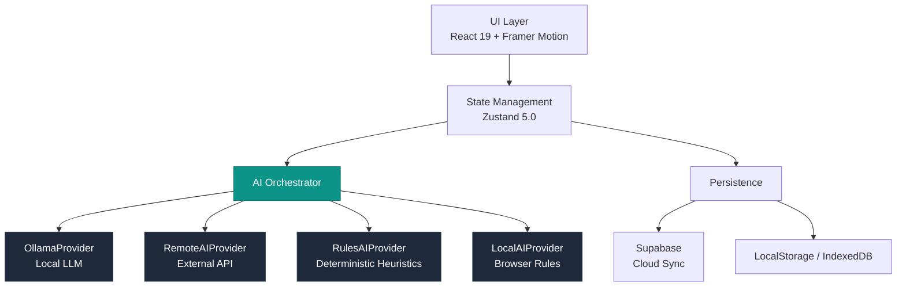
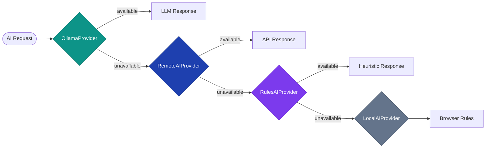

# GoalOS

**An AI-powered personal operating system for life management.**

GoalOS combines structured goal tracking, habit management, achievement systems, timeline visualization, and financial planning into a single local-first application. The core engineering decision is a pluggable AI orchestrator with a multi-provider fallback chain, enabling full functionality whether connected to a local LLM, a remote API, or running entirely offline with deterministic heuristics.

Built with React 19, TypeScript (strict), and Zustand. Designed to run anywhere.

---

## Architecture



---

## Key Features

### Goals and Milestones

Structured goal management with AI-assisted decomposition. Goals break down into milestones, milestones into tasks. The AI can take a vague idea and produce a concrete plan with measurable checkpoints. Progress rolls up automatically from task completion through milestones to the parent goal.

### Habits and Streaks

Daily check-in system with streak tracking and a consistency heatmap. Historical data feeds into the AI layer for weekly and monthly insight generation.

### Achievements System

Dual-mode achievements: automatic unlocks triggered by system events (completing a streak, hitting a milestone) and manual entries for real-world wins. Achievements are categorized by rarity tier, with celebration UX built with Framer Motion.

### Timeline and Life Events

A visual chronological record combining life events, wins, achievements, and AI-generated monthly reviews into a single navigable timeline.

### AI Intelligence Layer

Seven distinct AI capabilities power the system. The orchestrator selects the best available provider at runtime and degrades gracefully. No feature is blocked by the absence of a network connection or a running LLM.

### Analytics and Insights

Progress charts and heatmaps built with Recharts. Weekly summaries and monthly retrospectives are AI-generated, with stagnation detection that surfaces goals or habits that have gone cold.

---

## How the AI Works

### Provider Chain



| Priority | Provider | Environment | Latency | Quality |
|---|---|---|---|---|
| 1 | OllamaProvider | Local LLM | Low | High |
| 2 | RemoteAIProvider | External API | Medium | High |
| 3 | RulesAIProvider | Server-side heuristics | Minimal | Medium |
| 4 | LocalAIProvider | Browser rule engine | Minimal | Baseline |

### Graceful Degradation

Every AI capability has a deterministic fallback. The RulesAIProvider and LocalAIProvider use hand-written heuristics that produce structured, useful output without model inference. The app is fully functional offline, with no loading states that block UX when providers are unavailable.

### AI Capabilities

| Capability | Description |
|---|---|
| `generateGoalPlan()` | Transforms freeform text into a structured goal with milestones and tasks |
| `suggestMilestones()` | Decomposes a goal into ordered, measurable milestones |
| `suggestTasks()` | Breaks a milestone into actionable tasks with estimates |
| `classifyEntry()` | Categorizes quick-capture inputs (goal, habit, event, task) |
| `suggestAchievements()` | Analyzes activity to auto-unlock relevant achievements |
| `generateWeeklySummary()` | Weekly progress digest with priority suggestions |
| `generateMonthlyInsights()` | Monthly retrospective with trend analysis and stagnation detection |

---

## Tech Stack

| Layer | Technology |
|---|---|
| Framework | React 19, Vite 7 |
| Language | TypeScript (strict) |
| State | Zustand 5.0 |
| Styling | TailwindCSS 3.4 |
| Animation | Framer Motion |
| Forms | React Hook Form + Zod |
| Charts | Recharts |
| AI (local) | Ollama |
| Backend | Supabase (optional) |
| Deployment | Docker + Nginx |

---

## Repository Structure

```
goalos/
├── src/
│   ├── components/
│   │   ├── ai/              # AI chat, suggestion panels
│   │   ├── achievements/    # Achievement cards, unlock animations
│   │   ├── dashboard/       # Widgets, quick actions, metrics
│   │   ├── goals/           # Goal trees, milestone tracking
│   │   ├── habits/          # Check-in UI, streak displays, heatmap
│   │   ├── timeline/        # Chronological timeline view
│   │   └── ui/              # Reusable UI primitives
│   ├── lib/ai/
│   │   ├── orchestrator.ts  # Provider chain logic
│   │   ├── ollama.ts        # OllamaProvider
│   │   ├── remote.ts        # RemoteAIProvider
│   │   ├── rules.ts         # RulesAIProvider
│   │   └── local.ts         # LocalAIProvider
│   ├── features/            # Feature modules (server actions)
│   ├── pages/               # Route pages
│   ├── store/               # Zustand stores
│   └── hooks/               # Custom React hooks
├── docker/
│   ├── Dockerfile
│   └── nginx.conf
├── supabase/                # Migrations and seed data
├── .env.example
└── package.json
```

---

## Quick Start

### Development

```bash
git clone https://github.com/diegoperezg7/GoalOS.git
cd goalos
npm install
npm run dev                  # http://localhost:5173
```

All features work without any backend configuration.

**Optional: Enable local AI**

```bash
ollama pull llama3           # GoalOS detects Ollama automatically
```

**Optional: Enable Supabase sync**

```bash
cp .env.example .env         # Add your Supabase URL and anon key
```

### Docker

```bash
docker build -f docker/Dockerfile -t goalos .
docker run -p 8080:80 goalos
```

---

## Screenshots

> Screenshots pending. The app includes: dashboard with metric widgets and AI insights, goal detail view with milestone tree, habit heatmap, achievement gallery with rarity tiers, and timeline view.

---

## Design Decisions

### Why local-first AI

Privacy is non-negotiable for a life management tool. GoalOS defaults to Ollama, meaning all AI inference happens on-device. No goal descriptions, habit data, or personal reflections leave the machine unless the user explicitly configures a remote provider.

### Why the provider chain architecture

A single AI provider creates a hard dependency. The chain pattern decouples AI capabilities from any specific provider. Adding a new provider requires implementing one interface and registering it in the chain.

### Why offline-capable

A personal OS must be available when you need it, not when your network is. Every AI capability has a deterministic heuristic fallback. The Zustand stores persist to localStorage. Supabase sync is additive, not required.

---

## Roadmap

- **WebLLM provider** -- Run small language models directly in the browser via WebGPU
- **Calendar integration** -- Sync goals and habits with external calendar providers
- **Mobile PWA** -- Progressive Web App with offline caching and push notifications
- **Collaborative goals** -- Shared goals with role-based permissions via Supabase Realtime

---


## License

Copyright (c) 2024-2026 Diego Perez Garcia. All rights reserved.

This repository is published for **portfolio and evaluation purposes only**. You may view and read the contents to evaluate the author's technical capabilities. Copying, modifying, distributing, or using any part of this codebase for any purpose is prohibited without explicit written permission. See [LICENSE](LICENSE) for full terms.
